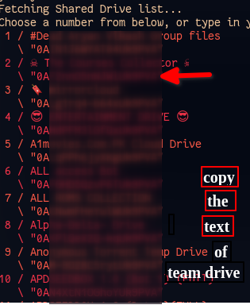

# Setup

1. open terminal and configure at least one team drive using 

```bash
rclone config
```

2. Open the rcloneconfig.py in any text editor
   - location - This variable holds the path of rclone.conf.
   - TEAMDRIVEINFO- This variable hold the name and id of Team drives(**must be modified**)

3.  Modify the  TEAMDRIVEINFO variable by copying the team drives  information from the terminal

   

   4. Run the pyhton file .
   5. All the TeamDrives now have been added to rclone.
   6. To update the team /shared drives in future simply ReRun the script without any modification.